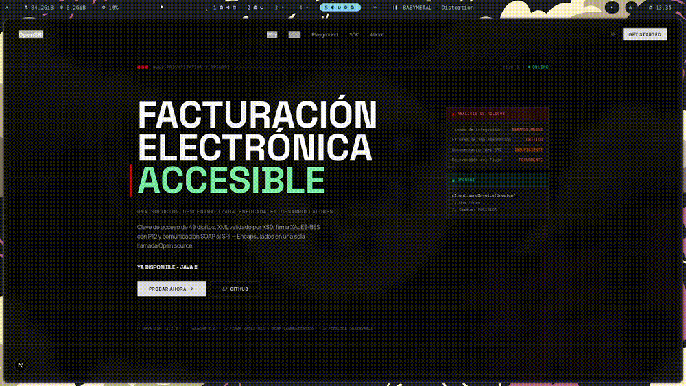
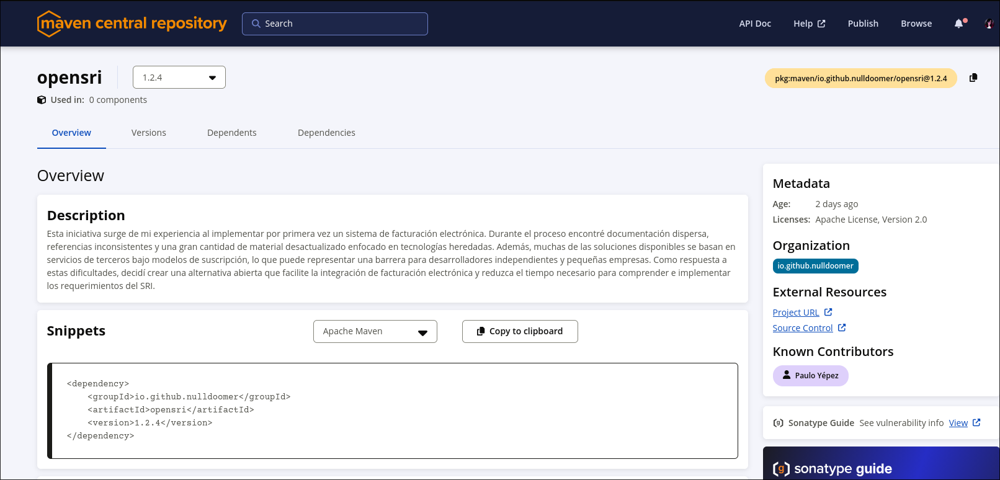

# Open-SRI

SDK open-source multi-lenguaje y playground interactivo para la facturación electrónica del SRI (Ecuador).
Maneja generación de clave de acceso, serialización XML (validada con XSD), firma digital XAdES-BES
y comunicación SOAP con el entorno de pruebas — para que no tengas que hacerlo tú.

[](https://central.sonatype.com/artifact/io.github.nulldoomer/opensri)
[](LICENSE)
[](https://openjdk.org/projects/jdk/21/)
[](https://ko-fi.com/nulldoomer)



---

## Por qué existe esto

Integrar facturación electrónica con el SRI implica mucho más que generar una factura.
Hay que construir una clave de acceso de 49 dígitos, generar XML con esquemas específicos,
firmarlos con XAdES-BES y comunicarse con servicios SOAP — todo sin una librería oficial que lo abstraiga.

Como resultado, cada empresa, startup o desarrollador independiente termina implementando la misma
lógica una y otra vez. Muchas de las soluciones disponibles además se basan en servicios de terceros
bajo modelos de suscripción, lo que representa una barrera innecesaria.

**Open-SRI encapsula todo ese flujo en un SDK open-source**, documentado y probado, para que puedas
concentrarte en construir tu producto, no en descifrar los detalles internos del SRI.

---

## Qué hace

| Paso | Qué maneja Open-SRI |
|---|---|
| 1 | **Generación de clave de acceso** — 49 dígitos con dígito verificador módulo 11 |
| 2 | **Serialización XML** — JAXB, validado contra los XSD oficiales del SRI (v1.0–v2.1) |
| 3 | **Firma XAdES-BES** — RSA-SHA256 con tu certificado PKCS#12 |
| 4 | **Envío SOAP** — `RecepcionComprobantes` + `AutorizacionComprobantes` |

---

## SDK Java

### Instalación

**Gradle (Kotlin DSL)**
```kotlin
dependencies {
    implementation("io.github.nulldoomer:opensri:1.2.4")
}
```

**Maven**
```xml
<dependency>
    <groupId>io.github.nulldoomer</groupId>
    <artifactId>opensri</artifactId>
    <version>1.2.4</version>
</dependency>
```



### Uso rápido

```java
// 1. Construir el cliente

    Ruc issuerRuc = new Ruc("1710034065001");
    IssuerProfile profileUnderTest = new IssuerProfile(issuerRuc, null, AccountingObligation.SI);
    InputStream stream = getClass().getResourceAsStream("/test-firma.p12");
    byte[] certBytes = stream.readAllBytes();
    OpenSRIClient openSRIClientUnderTest =
        OpenSRIClientBuilder.builder()
            .environment(Environment.PRUEBAS)
            .certificate(certBytes)
            .certificatePassword("password")
            .certificateAlias("sri-test-firma")
            .issuerProfile(profileUnderTest)
            .timeout(200)
            .build(); 


// 2. Construir una factura
     Invoice invoice = InvoiceBuilder.builder()
     // Paso 1: Definir la fecha de emisión
     .issueDate(IssueDate.of(LocalDateTime.now()))
     // Paso 2: Dirección del establecimiento emisor
     .establishmentDirection("Calle Principal 123, Quito, Ecuador")
     // Paso 3: Información del cliente/comprador
     .client(buyerInfo)
     // Paso 4: Información tributaria
     .taxInfo(taxInfo)
     // Paso 5: Número de documento (factura)
     .documentNumber("01-001-000000001")
     // Paso 6: Forma de pago
     .payment(paymentInfo)
     // Paso 7: Versión XML del SRI
     .documentVersion(DocumentVersion.VERSION_2_1_0)
     // Paso 8: Agregar ítems (productos/servicios)
     .addItems(List.of(
         InvoiceItem.builder()
             .description("Producto A")
             .quantity(2)
             .unitPrice(BigDecimal.valueOf(50.00))
             .build(),
         InvoiceItem.builder()
             .description("Servicio B")
             .quantity(1)
             .unitPrice(BigDecimal.valueOf(100.00))
             .build()
     ))
     // Paso 9: Definir moneda
     .addCurrency(Currency.USD)
     // Paso 10: Agregar información adicional (opcional)
     .addInfos(List.of(
         AdditionalInfo.of("telefono", "0987654321"),
         AdditionalInfo.of("email", "cliente@example.com")
     ))
     // Paso final: Construir la factura
     .build();

// 3. Enviarlo
SendInvoiceResult result = client.sendInvoice(invoice);

System.out.println("Clave de acceso: " + result.accessKey());
System.out.println("Estado:          " + result.authorizationResponse().status());
```

### Requisitos

- Java 21+
- Certificado PKCS#12 emitido por el SRI (para pruebas, un certificado auto-firmado funciona)

---

## Playground (web)

Una UI interactiva donde puedes construir una factura desde el navegador, ver cada paso del pipeline
animado en tiempo real, inspeccionar el XML generado (firmado y sin firmar) y ver la respuesta del SRI —
sin instalar nada.

**Frontend:** Next.js 14 · Tailwind CSS · Shadcn/UI · Vercel  
**Backend:** Spring Boot 4 · Spring WebFlux · Spring Security · Micrometer/OpenTelemetry · Railway

> El Playground está en desarrollo activo. La integración con Redis y la conexión frontend–backend están en progreso.

---

## Estructura del proyecto

```
Open-SRI/
├── sdk/sri-sdk-java/        # SDK Java — publicado en Maven Central
├── playground-service/      # Backend Spring Boot (WebFlux, Security, OTel)
└── frontend/                # Frontend Next.js 14
```

---

## Compilar desde el código fuente

**SDK**
```bash
cd sdk/sri-sdk-java
./gradlew build
```

**Backend**
```bash
cd playground-service
./gradlew bootRun
```

**Frontend**
```bash
cd frontend
bun install
bun dev
```

---

## Roadmap

- [x] SDK Java — publicado en Maven Central
- [x] SSE Backend reactivo con conexion a Redis
- [x] Conexión frontend ↔ backend
- [ ] SDK C#
- [ ] SDK Go

---

## Seguridad

El SDK procesa tu certificado PKCS#12 únicamente en memoria. La contraseña se maneja como `char[]`
y se limpia después de su uso. No se registran ni persisten certificados ni contraseñas en ningún momento.

El Playground es exclusivamente para el **entorno de pruebas del SRI** (sandbox). No uses certificados de producción.

---

## Contribuir

Issues y PRs son bienvenidos. Lee [CONTRIBUTING.md](CONTRIBUTING.md) para comenzar.

Si este proyecto te fue útil, puedes invitarme un café ☕

[](https://ko-fi.com/nulldoomer)

## Licencia

[Apache 2.0](LICENSE) © 2026 Nulldoomer
